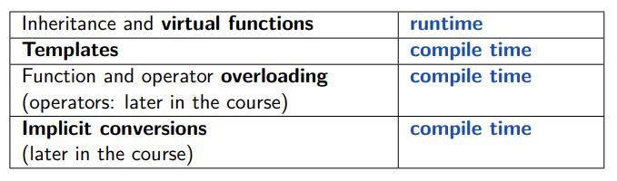
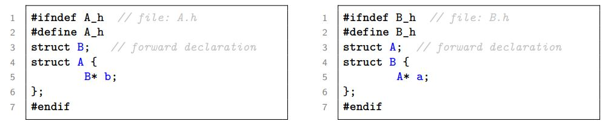

## Intro

C++ offers many language features, such as

- Procedural programming
- Object-oriented programming
- Generic meta programming
- Functional programming

Large code bases can be handled, C++ allows easy access to C APIs, allows low level optimizations, and is a very powerful language.

## Hello World

Standard libary elements are in the **namespace** "std" and can be accessed with the **#include** keyword.  
C++ compilers generate platform dependent binaries, f.e. Java is platform independent. C++ programs need to be compiled for each platform.

### How to edit & compile

Edit a C++ file wit ``gedit helloworld.cpp`` and compile it with ``g++ -c helloworld.cpp`` .  
Link the file and build an executable with ``g++ helloworld.o -o helloworld.exe`` . --> ``./helloworld.exe``  

### Declarations & Definitions

**Declarations** introduce the existence of structures, variables, functions, etc. --> declare a function:

```cpp
int add(int, int);
```

**Definitions** are declarations, which contain all information about the declared thing. --> define a function:

```cpp
int add(int a, int b) {
    return a + b;
}
```

**ODR** (One Definition Rule)

- Only one single definition of a function, variable, class, etc. is allowed.
- Every used thing must be defined somewhere.

Redeclaration of a function is allowed, if the definition is the same.

### Modularization

**Header files** contain declarations, which can be included in other files.

```cpp
// helloworld.h
#ifndef HELLOWORLD_H
#define HELLOWORLD_H
    int add(int, int);
#endif
```

```cpp
// helloworld.cpp
#include "helloworld.h"
    int add(int a, int b) {
        return a + b;
    }
```

**Libaries** are collections of header files, which can be included in other files.
They can be either static (*.a/*.LIB) or dynamic (*.so/*.DLL).

### Namespaces

**Namespaces** are used to avoid name collisions.

```cpp

namespace mynamespace {
    int add(int a, int b) {
        return a + b;
    }
}

int main() {
    int a = 1;
    int b = 2;
    int c = mynamespace::add(a, b);
    return 0;
}
```

### Makefiles

**Makefiles** are used to automate the build process.

CMake is a Makefile generator, which can be used to generate Makefiles for different platforms.

### First Steps

#### Functions

- Functions can be defined for different types. --> **overloading**
- Function calls with ambiguous types are not allowed. --> **overloading resolution**

#### Variables, Narrowing

- Variables are defined prior usage.
- Initialization ``a=2`` is deprecated, use ``a{2}`` or ``a={2}`` instead.
- Narrowing: losing information during type conversion. --> ``int a = 2.5;``
- Array variables are defined: ``TYPE arr[NUM]``.
- C++11 defined std::array ``std::array<TYPE, NUM> arr``.
- Array sizes must be known at compile time.

#### Constants

- Constants are defined with ``const``.
- const variabes protect variables from modification.
- constexpr variables protect variables from modification and allow compile time evaluation.

### Refrences & Pointers

#### Pointers

Features:

- Pointer = address (where) + optional: type (what)
- Nullpointer = ``nullptr``
- Pointer arithmetic: address modifications

Use cases:

- Data structures --> Lists
- Data referencing (passing pointers instead of values)
- Dynamic memory management

**Pointer declaration** ``TYPE*name {...};``
Addresses of variables can be accessed with ``&name``  
Pointer arithmetic is possible --> ``&c2-&c1``  
To access the data to which a pointer is pointing use the dereference operator ``*`` --> ``*name=2;``

```cpp 
void swap(int* a, int* b) {
    int tmp = *a;
    *a = *b;
    *b = tmp;
}

int main() {
    int x{2},y{3};
    int *xp = &x;
    swap(xp, &y);
    swap(&x, &y);
}
```

#### References

- Reference variable declaration: ``TYPE& name{...};`` - no reassignment possible
- References are aliases for variables
- Accessing a reference is the same as accessing the original value
- References can't be null

#### C-Strings  

- C-Strings are arrays of characters,
- ``const TYPE* ptr``is a pointer to a const TYPE
- ``TYPE* const ptr``is a const pointer to a TYPE

#### Different function parameters  

**Pass by value** ``func (TYPE value)`` --> copy value (input, small TYPES)  
**Pass by reference**:  
``func (TYPE &value)`` --> reference to original value (input, output)
``func (const TYPE &value)`` --> reference to original value (input, large TYPES)  
**Pass by pointer**:  
``func (TYPE *value)`` --> reference to original value (input, output)  
``func (const TYPE*value)`` --> reference to original value (input)

### Dynamic Memory Management

**Allocation** ``TYPE*ptr=new TYPE{init};``  
**Deallocation** ``delete ptr;``  
**Allocate N data element** ``TYPE* ptr = new TYPE[N];``  
**Access** ``ptr[i]``  
**Deallocate** ``delete[] ptr;``  
**Dangling pointer** is a pointer, which points to a deallocated memory location.


### I/O

**Open a file** ``std::ifstream``  
**Read from a file** ``std::getline(std::cin, line);``  
**Write to a file** ``std::cout << "Hello World" << std::endl;``

## Classes & Objects

### Classes

- Classes are identified with the keyword ``class`` or ``struct``.
- Member variables are defined in the class.
- The constructor has the same name as the class and is called when an object is created.
- The destructor has the same name as the class following a tilde, has no parameters and is called when an object is destroyed.

```cpp
class MyClass {
    public:
        MyClass(int a, int b);
        ~MyClass() {}
        int compete();
    private:
        int a, b;
};
```

- Access modifiers control how members can be accessed.

  - `public` accessible from everywhere, default for structs
  - `private`accessible from inside only, default for classes
  - `protected` accessible from inside and subclasses

### Objects

Syntax: ``ClassName variableName;`` or ``ClassName variableName{...};`` or ``ClassName variableName(...);`` or ``ClassName variableName{};``

### Storage Duration

**Static storage duration** is the lifetime of a variable, which is the whole program.  
**Automatic storage duration** --> local variables, initialized when entering the scope and destroyed when leaving the scope.  
**Dynamic storage duration** --> user controlled lifetime, allocated with ``new`` and deallocated with ``delete``.

### Modern Storage Duration

Rule: do not use new/delete in modern C++.  

- ``std::shared_ptr<TYPE>`` is a smart pointer, which manages the lifetime of an object.
- ``std::unique_ptr<TYPE>`` is a smart pointer, which manages the lifetime of an object and can't be copied/shared.
- ``std::weak_ptr<TYPE>`` is a smart pointer without ownership - must be converted to a shared_ptr to access the object.
- No need to delete objects, which are managed by smart pointers.

Rule: use raw pointers with care in modern C++.

- Use **shared_ptr<T>** instead of **T\*** to express shared ownership.
- Use **unique_ptr<T>** instead of **T\*** to express private ownership.
- Use **weak_ptr<T>** instead of **T\*** to express no ownership.
  


### Inline Functions

Implicit inline member functions are functions, which are defined in the class declaration.  
Explicit inline (member) functions start their definition with the keyword ``inline``.  
constexpr functions are implicitly inline.

### Const Methods

Syntax: add ``const`` after the parameter list.  
Compiler guarantees that the method does not modify the object.
In a const context the compiler only allows const access.  
``const`` allows to control whether a function is allowed to be called or not in a given context.

### Constexpr Functions

Syntax: add ``constexpr`` in front of the function name.  
Semantic:  
constexpr functions are enabled to be used in constexpr expressions.  
constexpr functions may only use restricted language features.  
Notes:  
constexpr constructors are possible  
a constexpr function can be called at compile time or at runtime

### Static Members

Syntax: add ``static`` in front of the member declaration.  
They exist once per class and have static storage duration. - Definition and initialization happens outside the class

### Unions

Unions are data structures, which can store different types of data in the same memory location.  
Unions can only store one attribute at a time.
The programmer is responsible for managing what attribute is stored in the union.  
``std::variant`` are modern unions and manage themselves what attribute is stored.

### Constructors & Destructors

#### Default Constructor

- Default constructor is a constructor, which has no parameters.
- Implicit default constructor is generated, if no constructor is defined.
- Can be requested with ``=default``.

#### Initialization of composed objects

All member variables are initialized in the order of declaration.  
The constructor definition is called *after* the initialization of the member variables.

#### Default member initializer

Defaultmember initializer is a default value for a member variable, which is used if no value is provided in the constructor.  
Zero initialization is specified with an assignment of ``{}``.  
If no default member initializer is specified, the member variable is default initialized.

- class/struct type members are default constructed
- non-class type members get undeterminate values

#### Member initializer

Member initializer is a constructor, which initializes the member variables with the provided values.

### Copying Objects

#### Copy Constructor & Operator

- Copy constructor is a constructor, which takes a reference to the same class as parameter.
- Copy initialization is performed when, creating a new object, the source object is a value.
- Copy assignment is performed when, assigning a value to an existing object, the source object is a value.

Copying takes a const reference to the object to be copied from, because the object to be copied from shall
never be changed by the act of copying.  
You can delete the copy constructor and copy assignment operator with ``=delete``.  

### Moving Objects

Lvalue references can be used to alias an existing object.  
Syntax: ``TYPE %ref;`` --> "Things with a name"  
Rvalue references may extend the lifetime of temporary objects.  
Syntax: ``TYPE &&ref;`` --> "Things without a name" (references to a return value)

```cpp
#include <iostream>
int f(int x) {return 3*x;}
void g(int &x) {std::cout << "lvalue" << x << "\n";}
void g(int &&x) {std::cout << "rvalue" << x << "\n";}

int main() {
    int x = 2;
    g(x); // lvalue --> x has a name
    g(3); // rvalue --> "3" has no name
    g(f(x)); // rvalue --> return value of f(x) has no name
}
```

#### Explicit Move

``std::move`` is a cast to an Rvalue.  
Use case: move a non-copyable object.

- ``TYPE a = std::move(b);`` --> move initializes a with b and leaves b in an unspecified but valid state
- ``a = std::move(b);`` --> moves b to a and leaves b in an unspecified but valid state

### Rule of zero

If you implement one of the following, also implement the other ones:

- Destructor
- Copy constructor
- Assignment operator
- ("Copy-swap")

Choose copy behavior:

- Default (``=default``) - flat copy
- Deep copy - copy all members
- No copy (``=delete``) - no copy allowed

**Rule of three** add move constructor and move assignment operator and destructor  
**Rule of five** add move constructor and move assignment operator  
**Take into account** Manage at most one resource explicitly - better use existing classes

## Templates

### Function templates

A simple function is defined as follows:

```cpp
template <class T>
ReturnValue functionName(Parameters) {...}
```

or

```cpp
template <typename T>
ReturnValue functionName(Parameters) {...}
```

A template defining a maximum-function:

```cpp
template <class T>
inline const T& max (const T  &a, const T  &b) {
    return  a<b ? b:a;
}
```

A function template itself needs to be instantiated.  
It is **implicitely instantiated** when it is used the first time.  
Alternatively it can be **explicitely instantiated** with the keyword ``template``.

```cpp
template <class T> const T& max (const T&a, const T&b) {return a<b ? b:a;}

//explicit instantiation
template const int& max<int>(const int&, const int&);

int main()
{
    max(1,2); //implicit instantiation
}
```

When using a template, parameters can be deduced implicitly from the passed function argument types or
explicitely by specifying the desird template arguments after the function call.

```cpp
template <class T> const T& max (const T&a, const T&b) {return a<b ? b:a;}
int main(){
    max(1.0,2.0); //max<double via deduction>
    max(1,2); //max<int> via deduction
    max<>(1,2); //max<int> via deduction
    max<double>(1,2); //explicit template parameter specification
}
```

Attention: Only works in unambiguous cases.  
``max(float, double)`` and ``max(double, float)`` are ambiguous.  
If ambiguos you can explicitly specify the template arguments or disambiguate the parameters using a cast.  
``max<float>(double,float)`` --> float  
``max(double, static_cast<double>(float))`` --> double

### Class templates

A simple class template is defined as follows:

```cpp
template <class T>
class className{...};
```

- Inside the class ``T`` can be used as a type
- ``className<T>`` denotes an instantiated class template
- Inside the class declaration, ``className<T>`` and ``className`` are equivalent
- Instantiation can be implicit or explicit
- Template argument can be deduced implicitly or explicitely

Templates do not exist as type, they must be instantiated.  
The compiler generates a new class for each template instantiation.

### Variable & Alias templates

- Syntax: ``using TYPE_NEW_NAME = OTHER_TYPE;``
- Alternative: ``typedef OTHER_TYPE TYPE_NEW_NAME;``
- ``using`` can be parameterized with templates
- ``typedef`` cannot be parameterized with templates

```cpp
template <class T>
using Text2Value = std::map<std::string, T>;
```

### Template parameters

More than one template parameter can be specified.

```cpp
template <class T1, class T2>
class className{...};
```

Template parameters can also be integral types (int) but must be know at compile time.

### Template specialization

- Templates can be specialized for certain types to provide type specific behavior
- Syntax: ``template <>`` followed by the concrete function/class definition

```cpp
#include <cstring>

template<class T> T max (T a, T b) {return a<b ? b:a;}

template<> 
const char* max<const char*>(const char* a, const char* b) {
    return std::strcmp(a,b) < 0 ? b:a;
}
```

- Function template specialization interacts with function overloading
- More special templated overloads win over less special ones
- More specializations win over less special specializations
- Non-templated overloads win over templated overloads

```cpp
template<class T, class U>  void f(T t, U u) {...} //1
template<class T>           void f(T t, T u) {...} //2
template<>                  void f<int>(int t, int u) {...} //3
                            void f(int t, int u) {...} //4
int main(){
    f(1,1.2); //calls 1
    f(1.2,1); //calls 1
    f(1.3,1.3); //calls 2
    f(1,1); //calls 4 -- 3 is more specialized but 4 is not a template
}
```

### Depoly a template library

**Inclusion model:** (standard library)

- Deliver all library source code to customer (header files)
- Support unknown types (template instantiation is implicit)

**Explicit instantiation model:**

- Deliver template declarations only to customer (header files)
- Support foreseen types only (explicit template instantiation)

**C++ 20 modules:**

- Allows to deliver a kind of "precompiled templates"

### Compile time magic with templates

Recursive usage of template instantiations can be used to implement a compile time recursion.  
Template specialization is used to terminate the recursion.

```cpp
template <int N> struct SumFrom0toN{
    static constexpr int value=SumFrom0toN<N-1>::value+N;};

template<> struct SumFrom0toN<0>{
    static constexpr int value=0;};

int main(){
    return SumFrom0toN<3>::value; // 0+1+2+3=6
}
```

constexpr also allows compile time iterations

```cpp
constexpr int sum(int N){
    int res = 0;
    for(int i=0; i<=N; i++) res+=i;
    return res;
}

int main(){
    constexpr int res = sum(3); // 0+1+2+3=6
    return res;
}
```

``if constexpr(...)`` allows compile time switches

- ``if constexpr`` is evaluated at compile time
- In a template the discarded if-branch is not instantiated

### Variadic templates

- Variadic templates allow typesafe code with an arbitrary number of arguments

```cpp
#include <iostream>
template<class T> void print(T s){
    std::cout << s << ".";
}
template<class> T, class... Rest> void print(T s, Rest... rest){
    std::cout << s << ",";
    print(rest...);
}
int main(){
    print("Hello", "World", 1.9, 8); // "Hello,World,1.9,8."
}
```

- The template parameters representing a list of type parameters are called **type parameter pack**: ``class... Rest``
- A function parameter pack is used to declare functions with arguments corresponding to a type parameter 
pack: ``void f (Rest... params)``
- pack expansion allows to unpack the function arguments: ``f(params...)``

```cpp
template<class T> void print(T s){
    std::cout << s << ".";
}
template<class T, class... Rest> void print(T s, Rest... rest){
    std::cout << s << ",";
    print(rest...);
}
````

#### Examples from the standard library

- ``std::make_shared<TYPE> (Paramters)``: creates ``std::shared_ptr<TYPE>`` and calls ``new TYPE {Parameters}``
(forwards the constructor arguments to the constructor of ``TYPE``)
- ``std::make_unique<TYPE> (Paramters)``: creates ``std::shared_ptr<TYPE>``
- ``std::make_tupls(Paramters)``: creates ``std::tuple<...>``

Fold expressions allows to reduce arguments based on a parameter pack.  
Syntax:

- ``(pack op ...)``
- ``(... op pack)``
- ``(first op ... op pack)``
- ``(pack op ... op last)``

```cpp
template<class ...Args>
int sum_plus_2(Args... args){
    return (args + ... + (1*2));  //brackets mandatory
}

int main(){
    return sum_plus_2(5,4); // 5+4+2=13
}
```

### Other template related stuff

- **auto** is used 
  - to deduce a variable type from an initializer,
  - to deduce a function return type from a return expression, or
  - to deduce a (non-type) template parameter type.
- **decltype** is used to denote the type of a not-evaluated expression

Notes:

- **auto** can be decorated with ``&`` and ``const``
  - ``auto x = ...`` will always be a normal variable
  - ``auto x& = ...`` will always be a reference
  - ``const auto x& = ...`` will always be a const reference
- **decltype** represents the exact type of the expression passed to it

### Concepts

- Concepts are a way to express requirements on template parameters

## Inheritance

### Basics

```cpp
class B : public A { ...};
```

- ``B`` is a derived class of ``A`` (base class)
- B inherits all public/protected members of A (no private members)
- ``public`` inheritance: public members of A are public in B, protected members of A are protected in B
- constructor/destructor from base classes are not inherited/forwarded automatically
- constructors from base classes can be inherited with ``using``
- derived classes can redefine methods of base classes

```cpp
struct A{
    virtual void f(){std::cout << "a()\n";}
    A() {f();}
};

struct B : A{
    void f() override {std::cout << "b()\n";}
};

int main(){
    B b; // prints "b()"
}
```

Redefined functions must have the same parameters and return type as the base class function.

**Pure virtual functions:**

- are declared with ``=0``
- have no definition
- classes containing pure virtual functions are abstract classes and cannot be instantiated

```cpp
struct Contract{
    virtual int add(int x, int y) = 0;
};
struct Implementation : Contract{
    int add(int x, int y) override {return x+y;}
};
int main(){
    Implementation impl;
    impl.add(1,2); // 3
}
```

**Early binding:** (static binding) - the compiler knows the type of the object at **compile time**  
**Late binding:** (dynamic binding) - the compiler does know the type of the object at **run time**

### Casts & Conversions

- **Up-Cast** (implicit): Circle -> Shape (base class -> derived class)
- **Down-Cast** (explicit): Shape -> Circle (base class -> derived class)
- **Explicit cast:** ``static_cast<Derived*>(base_ptr)`` or ``dynamic_cast<Derived*>(base_ptr)``

static_cast - happens at compile time, no runtime checks, principal compatibility is checked  
dynamic_cast - happens at runtime, runtime checks, principal compatibility is checked

### Multiple inheritance

- Classes can be derived from more than one base class
- Every base class is represented on its own

```cpp
struct Vehicle{ int wheels; };
struct Boat : Vehicle{};
struct Car : Vehicle{};
struct Amphibian : Boat, Car{
    void setWheels(int w){
        wheels = w; // error: ambiguous
        Boat::wheels = w; // ok
        Car::wheels = w; // ok
        Vehicle::wheels = w; // error: ambiguous
    }};
```

### Code guidelines

Clarity

- C.135 Use multiple inheritance to represent multiple distinct interfaces
- C.131 Avoid trivial getters and setters

Performance

- C.132 Don't make a function virtual unless you intend to override it

Correctness

- C.133 Avoid protected data
- C.134 Ensure all non-const data members have the same access level
- C.128 Virtual functions should specify exactly one of virtual, override, or final
- C.126 An abstract class typically doesn't need a constructor

## Polymorphism



Polymorphism with function overloading:

```cpp
#include <iostream>

struct Cat {};
struct Dog {};

void make_noise(Cat) {
    std::cout << "meow.\n";
}
void make_noise(Dog) {
    std::cout << "bark.\n";
}

int main() {
    Dog d; 
    Cat c;
    make_noise(d); // bark.
    make_noise(c); // meow.
}
```

### Domain modeling

- **Domain modeling:** is the process of creating a conceptual model for a specific problem
- Composition - the part cannot exist without the whole (e.g. a car cannot exist without an engine)
- Aggregation - both partners exist independently (e.g. a company can exist without an employee)

```cpp
struct House { // composition
Room room1; // non-replaceable
std::unique_ptr<Room> room2; // replaceable - can be replaced
};
struct Company { // aggregation
std::shared_ptr<Person> person1; // with ownership
std::weak_ptr<Person> person2; // without ownership
};
```

**Is-A** relationship: A Circle is a Shape

### Forward declaration and incomplete types



Solution:

- ``struct Name;`` declares an incomplete struct
- you cannot use an incomplete struct but you can declare pointers/refrences to it

**Incomplete types:**

- Classes that have been declared but not defined
- Creating an object of an incomplete type is  an **ill-formed** construct
- Incomplete types are used for forward declarations

```cpp
class A;
int main(){
    A* ap; // ok: pointer to incomplete type
    A a; // error: incomplete type - ill-formed
}
```

## Operators

### Operator overloading

- Operators are functions or methods
- You cannot overload operators for built-in types (int, double, etc.)
- For custom types you can overload operators with the ``operator`` keyword

Types of operators:

- assignment operators (``=``, ``+=``, ``-=``, etc.)
- increment/decrement operators (``a++``, ``b--``, etc.)
- arithmetic operators (``+``, ``-``, ``*``, etc.)
- logical operators (``&&``, ``||``, ``!a``)
- comparison operators (``==``, ``!=``, ``<``, etc.)
- member acess operators (``a->b`` and ``a[b]``, etc.)
- function call operators (``a()`` and ``new/delete``)

**``a op b`` --> ``a.operator op(b)``**

```cpp
#include <iostream>

struct A{
    int sum = 0;
    A& operator<<(int x){sum += x; return *this;}
};

int main(){
    A a;
    a << 5 << 10 << 1; (a<<5) yields a again (return *this) // a = 16
    a.operator<<(4); // same as a << 4
    std::cout << a.sum; // 20
}
```

### Custom unary operators

- as method

```cpp
struct A{
    B operator!(){...}
};
```

- as free function

```cpp
B operator!(A& a){...}
```

**``++`` & ``--``**

The unary increment and decrement operators are special because they can be used as both prefix and postfix operators.  
--> A dummy parameter is inserted for the postfix version

```cpp
a++; // corresponds to a.operator++(0)
++a; // corresponds to a.operator++()
```

### Friends

- you can grant access to private attributes/methods to friends.
- a class decides which friend it has

```cpp
class A{
    friend void someGlobalFunction(); // someGlobalFunction can access private attributes of A
    friend int B::someMethod(); // B::someMethod can access private attributes of A
};
```

Example (class A grants access to class B to have private access to A)

```cpp
class B {
    ...
    public:
        void method1(A a1);
        int method2 (A& a2);
};

class A{
    private: ..
    public: ..
    friend class B;
};
```

### Lookup details

ADL (Argument Dependent Lookup) - the compiler searches for a function in the namespace of the argument  
For unqualified function calls, the compiler searches for a function in the namespace of the argument

```cpp
#include <iostream>

namespace detail {
    struct A {
        int x;
    };

    std::ostream &operator<<(std::ostream &os, const A &a) {
        os << "A.x=" << a.x;
        return os;
    }

    void f(const A &a) { std::cout << "f(" << a.x << ")\n"; }

    void f(int x) { std::cout << "f(int: " << x << ")\n"; }
}

int main() { // which line does not compile?
    detail::A a{11};
    std::cout << a << "\n";
    f(a);
    //f(a.x); // does not compile 
    //f(3); // doesn't compile - f not defined in scope
    detail::f(4);
```

### Iterators

Iterators are abstractions of pointers and are used to:

- iterate over a container (array, list, etc.)
- point to elements in a container
- define ranges

How do they work?

- ``operator*`` and ``operator->`` are overloaded to mimic how dereferencing a pointer works
- ``operator[]`` is overloaded to mimic array-like access
- ``operator++`` and ``operator--`` are overloaded to mimic how incrementing a pointer works

```cpp
#include <iostream>
#include <vector>

int main() {
    std::vector<int> v{1, 2, 3, 4, 5};
    auto it = v.begin(); // points to the first element
    std::cout << *it << "\n"; // 1
    std::cout << it[2] << "\n"; // 3
    ++it; // points to the second element
    std::cout << *it << "\n"; // 2
}
```

### Functors

- Functors are objects that can be called like functions
- The standard library makes use of such function objects

```cpp
std::plus<int> adder;
std::cout << adder(1, 2) << "\n"; // 3
```

- Lambdas are modern replacements for functors
- Functors objects override the ``operator()`` to mimic a function call
  - Inlining makes this technique efficient
  - They can contain a state
  - They can be defined within a code block

```cpp
struct Adder{
    int operator()(int a, int b){
        return a + b;
    }
};
int main(){
    Adder adder;
    return adder(1, 2); // 3
}
```

C++ Lambdas are a shortcut to define certain kinds of functors.  
**Syntax** ``[capture](parameters) mutable -> return-type {body}``

- ``[capture]``: controls how the environment is captured
- ``(parameters)``: the list of function parameters
- ``mutable``: controls if the created function represents a constant object or a mutable one
- ``-> return-type``: the return type of the function

Lambda capture list:

- ``[]``: capture nothing
- ``[=]``: capture everything by value (copy)
- ``[&]``: capture everything by reference (``this`` is always copied)
- ``[&a, b, c=b*2,d]``: captures ``a`` by reference, ``b`` and ``d`` by copy and defines ``c`` as new attribute

```cpp
#include <iostream>

int add(int a, int b) { return a + b; }
int main() {
    auto add3 = [](int a) { return add(a, 3); };
    std::cout << add3(2) << "\n"; // 5
    struct X {
        int x = 0;
        void f() { std::cout << x++ << "\n"; }
        auto getF() { return [this]() { f(); }; }
    } x;
    auto f = x.getF();
    auto g = [&x]() { x.f(); };
    g(); // 0 - ruft x.f() auf --> x++
    f(); // 1 - ruft x.f() auf --> x++
    g(); // 2 - ruft x.f() auf --> x++
    std::cout << x.x << "\n"; // 3
}
```

## Conversions

### Implicit conversions

Integral values with less bits than an ``int`` can be converted to an ``int`` without loss of information.  
Floating point values with less bits than a ``double`` can be converted to a ``double`` without loss of information.

```cpp
int main() {
    int i = 1;
    long l = 2;
    float f = 3.0f;
    double d = 4.0;
    i = l; // ok
    i = f; // ok
    i = d; // ok
    l = f; // ok
    l = d; // ok
    f = d; // ok
}
```

### Overload resolution

Every candidate function is compared, if the arguments are applicable.

- **perfect match**: the argument types match the parameter types exactly
- **integral/floating point promotion**: (``char`` to ``int``, ``bool`` to ``int``)
- **standard conversion**: any possible conversion (``float`` to ``int``, ``int`` to ``double``)
- **user-defined conversion**: any conversion defined by the user (``class A`` to ``class B``)

```cpp
void g(int){std::cout << "g1\n";}
void g(long long){std::cout << "g2\n";}
void f(int, double){std::cout << "f1\n";}
void f(char, long double){std::cout << "f2\n";}

int main(){
    char c='a';
    double d=2;
    float fl=2;
    long l=2;

    g(c); // g1
    g(l); // g2
    f(c,fl); // f1
    f(c,d); // f2
}
```

**Derived classes:** Pointers can be converted according to inheritance rules. A pointer to a derived class can be converted to a pointer to a base class.  
**const pointers/references:** A pointer/reference to a non const value can be converted to a pointer to a const value of the same type.  
**Pointers** can be converted to a bool value. Every pointer that is not ``nullptr`` is converted to ``true``.

```cpp
#include <iostream>
void f(bool x) {std::cout << "x==" << x << "\n";}
int main(){
    int *p = nullptr;
    f(p); // x==0
}
```

### Custom conversions

You can specify how custom classes are converted from/to other types.

- **conversion constructor**: other types to my custom class
- **conversion operator**: my custom class to other types

```cpp
struct  A {A(int x){} };
struct  B {
            explicit B(int x {}
            B(int x, float y) {}};

int main(){
    A a = 3;
    B b = static_cast<B>(3);
    b = 3; // error - explicit
    b = B{3};
    b = {3, 1.2};
}
```

The operator ``TYPE()`` defines how a class is implicitly converted to a type.  
The keyword ``explicit`` forces to use a ``static_cast`` for conversions.

```cpp	
#include <iostream>

struct A { explicit operator float() {return 1.2; } };

template<class T, class U>
T f(U x) { return static_cast<T>(x); }

int main() {
    std::cout << f<float>( 10 ) << "\n";
    std::cout << f<float>( A{} ) << "\n";
}
```

### Enumerations

Can be defined in two ways:

- scoped enumerations: ``enum class name : type = { enumerators };``
- unscoped enumerations: ``enum name : type = { enumerators };``
- the underlying type must be an integral type (``int`` by default)
- all values can be represented

```cpp
enum class MyEnum : char {
    yes = 'y',
    no = 'n',
    other = 'o'
    another // value is 1 more than the previous one
};
```

### User defined literals

User defined literals allow to define shortcuts to convert numerical or string values to other types. User defined literals always start with an underscore.

```cpp
#include <iostream>
#include <cmath>

constexpr long double operator "" _deg(long double x) { return x*M_PI/180.0; }

int main() {
    std::cout << 180.0_deg << "\n"; // --> 3.14159
}
```
